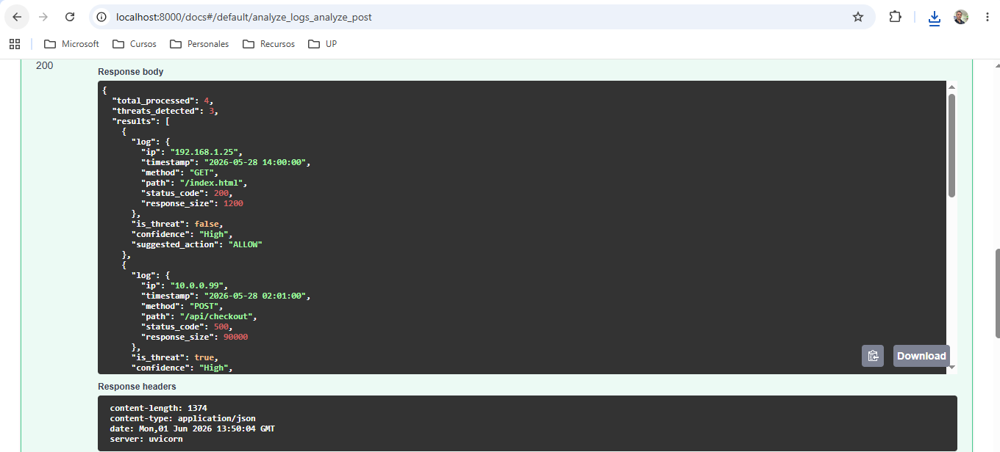
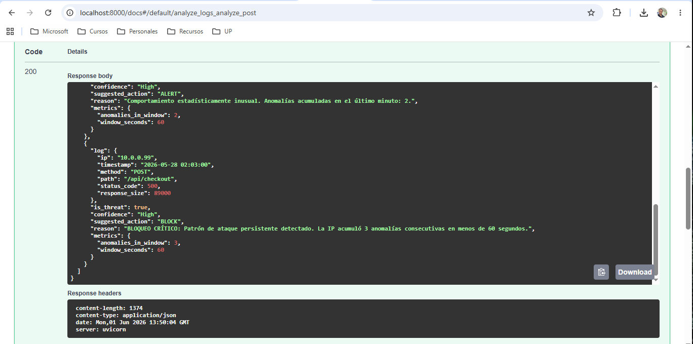
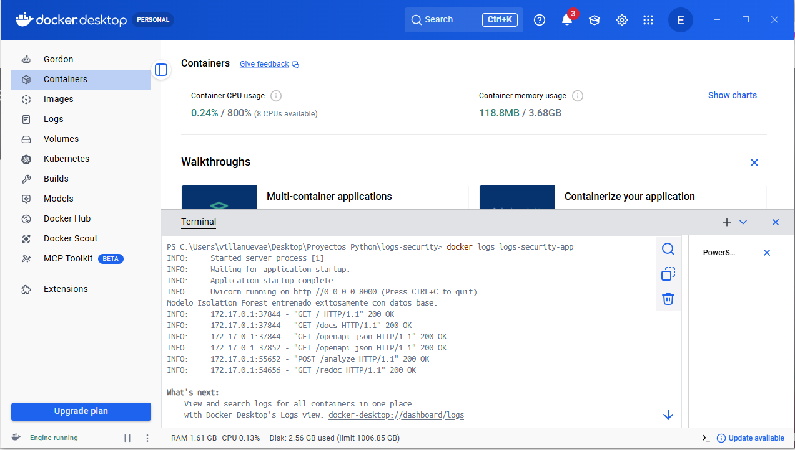

# Detector de Anomalías de accesos
Este proyecto implementa un pipeline inteligente y contenedorizado para la detección, análisis y mitigación de anomalías en registros de accesos (logs) en tiempo real.

## 🧠 Arquitectura de la Solución
A diferencia de los sistemas tradicionales estáticos, esta solución implementa una Arquitectura Orientada a Eventos y Agentes con Estado (Stateful), emulando los entornos de alta escala de Mercado Libre:

**Log Ingestion Agent**: Se encarga del parsing, limpieza y transformación de los datos crudos (JSON) en vectores numéricos legibles por la IA.
**AI Core (Isolation Forest)**: Un modelo de Machine Learning no supervisado ideal para ciberseguridad, ya que identifica anomalías por aislamiento de forma eficiente y con bajo consumo de CPU.
**Stateful Decision Agent (Mitigación Contextual)**: El núcleo del sistema. Utiliza una memoria en caché con una estrategia de Ventana Deslizante de 60 segundos. Si una IP genera anomalías consecutivas, el agente escala de forma autónoma la acción de ALERT a BLOCK, previniendo ataques distribuidos o de fuerza bruta.

**💡 Nota de Arquitectura:** La memoria actual se emula mediante un defaultdict optimizado en la RAM del contenedor. En un entorno productivo, este componente se desacoplaría hacia un clúster de Redis para soportar el escalado horizontal de las instancias de FastAPI.

## 🛠️ Tecnologías Utilizadas
**Python 3.10+** (Core del lenguaje)
**FastAPI** (Framework asíncrono de alto rendimiento)
**Scikit-Learn** (Modelo Isolation Forest)
**Pandas & NumPy** (Procesamiento de datos)
**Docker** (Contenedorización)
**Tailwind CSS **(Interfaz visual de la página principal)

## 🚀 Instalación y Despliegue con Docker
Debes tener Docker e instalado y corriendo en tu máquina. Luego, ejecuta los siguientes comandos en tu terminal dentro de la raíz del proyecto:

**1. Construir la imagen de Docker:** 
docker build -t logs-security .

**2. Correr el contenedor:** 
docker run -d -p 8000:8000 --name logs-security-app logs-security

**3. Verificar los logs de inicialización del modelo:** 
docker logs logs-security-app

## 🌐 Endpoints
**Página principal:** http://localhost:8000/ **Swagger:** http://localhost:8000/docs **REDOC:** http://localhost:8000/redoc

## Datos de prueba de funcionamiento:
[ 
    { "ip": "192.168.1.25", 
    "timestamp": "2026-05-28 14:00:00", 
    "method": "GET", 
    "path": "/index.html", 
    "status_code": 200, 
    "response_size": 1200 },
    { "ip": "10.0.0.99", 
    "timestamp": "2026-05-28 02:01:00", 
    "method": "POST", 
    "path": "/api/checkout", 
    "status_code": 500, 
    "response_size": 90000 },
    { "ip": "10.0.0.99",
    "timestamp": "2026-05-28 02:02:00", 
    "method": "POST",
    "path": "/api/checkout",
    "status_code": 500, 
    "response_size": 91000 }, 
    { "ip": "10.0.0.99", 
    "timestamp": "2026-05-28 02:03:00", 
    "method": "POST", 
    "path": "/api/checkout", 
    "status_code": 500, 
    "response_size": 89000 } 
]

## 📸 Evidencias

### 1. Interfaz Principal del Sistema
A continuación se detalla la landing page corporativa con el estado del sistema y accesos rápidos a la documentación:

### 2. Respuesta de la API y Mitigación de Amenazas
Muestra del procesamiento en lote donde el Agente de Decisión mitiga las amenazas aplicando un bloqueo crítico (`BLOCK`) por reincidencia:

### 3. Logs en Docker
Muestra del registro de logs en Docker
